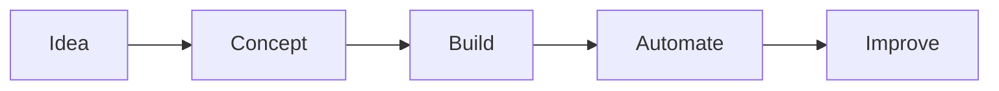

<p align="center">
  <sub>
    Building digital tools before "digital transformation" had a budget.
  </sub>
</p>

<p align="center">
  <a href="https://entidia.de"></a>
</p>


---

## Hey, I'm Markus

I build pragmatic digital tools for people and companies who want software to make work lighter, clearer and more useful.

My sweet spot is somewhere between **web development**, **process design**, **automation**, **AI workflows** and the occasionally stubborn real-world system that needs to behave nicely before anyone can go home.

```txt
Focus        Web apps, CRM systems, automation, AI-assisted workflows
Stack        Whatever best suits the project’s objective
Thinking     Useful first. Elegant where it matters. Maintainable always.
Base         Nuremberg, Germany
```

---

## Main areas in which I work

<table>
  <tr>
    <td width="50%">
      <h3>Digital Products</h3>
      <p>
        Custom applications, processes, workflows, platforms, and tools that fit the way teams actually work.
      </p>
    </td>
    <td width="50%">
      <h3>AI & Automation</h3>
      <p>
        Agentic workflows, AI-assisted development, multi-agent-setups and
        practical automation for everyday business processes.
      </p>
    </td>
  </tr>
  <tr>
    <td width="50%">
      <h3>Web & Infrastructure</h3>
      <p>
        Web applications, APIs, deployment pipelines, self-hosted services and
        the quiet server details that keep data safe and projects running.
      </p>
    </td>
    <td width="50%">
      <h3>Strategy & Consulting</h3>
      <p>
        Translating ideas, requirements and messy processes into clear technical
        concepts that teams can build on.
      </p>
    </td>
  </tr>
</table>

---

## Current Playground

<p>
  
  
  
  
  
  
  
  
  
  
  
  
</p>



---

## Selected Repositories

<!-- Replace these cards with the repositories you want to feature most. -->

<p align="center">
  <a href="https://github.com/mdeuerlein/homeassistant-icloud-fix">
    
  </a>
</p>

---

## How I Like To Build

> Small enough to understand. Useful enough to matter. Stable enough to trust.

- I prefer solid foundations and sharp user-facing details.
- I like systems that explain themselves through naming, structure and usability.
- I enjoy turning fuzzy business problems into reliable solutions.
- I use AI as a sparring partner, code assistant and workflow amplifier.

---

## GitHub Pulse

<p align="center">
  
  
</p>

---


